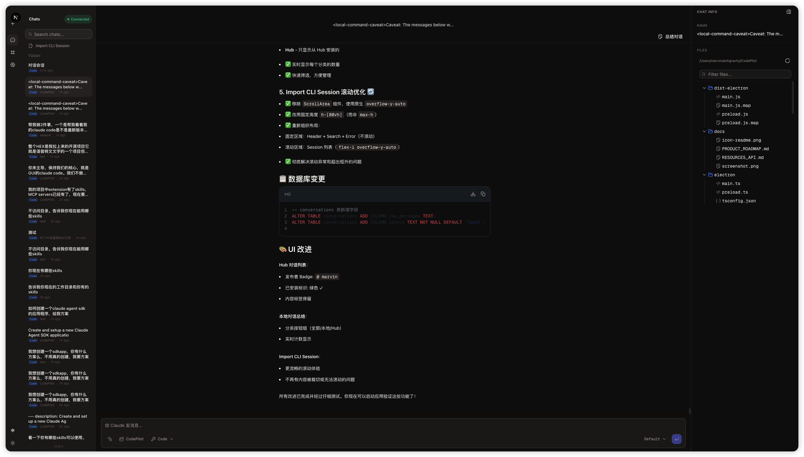
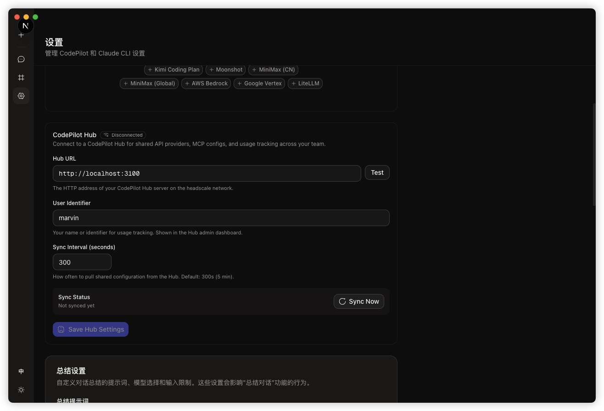
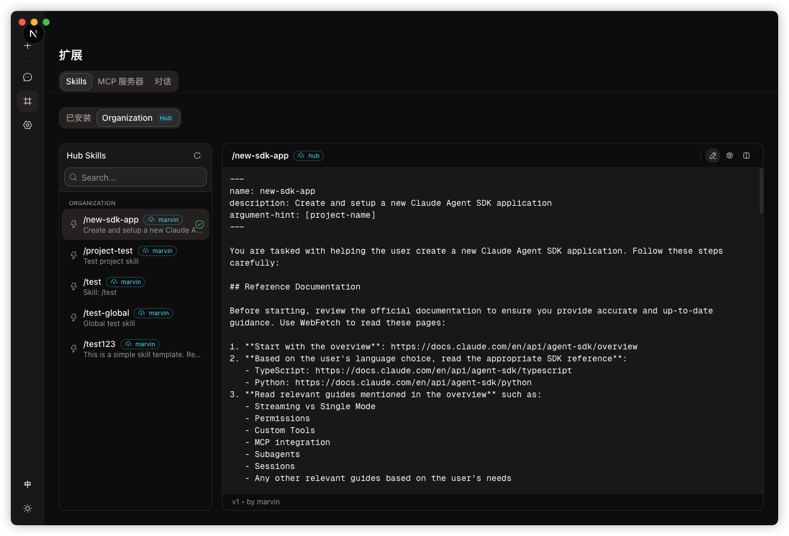
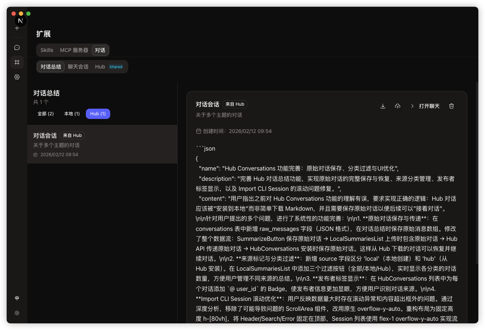
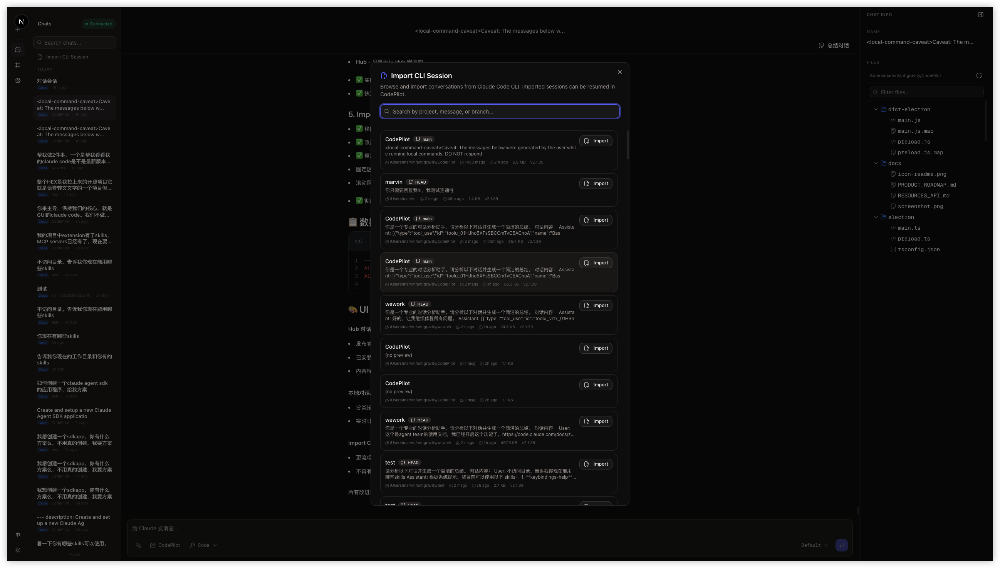

# CodePilot

**Claude Code 的原生桌面 GUI** — 通过可视化界面与 Claude 对话、编程、管理项目，而不是使用终端。

[](https://github.com/Marvinngg/ClaudeCodeGUI/releases)
[](https://github.com/Marvinngg/ClaudeCodeGUI/releases)
[](LICENSE)

[English](./README_EN.md)

---

## 核心理念

**CodePilot 是 Claude Code 的套壳 GUI，不是重新实现。**

- 所有 AI 能力通过 [Claude Agent SDK](https://www.npmjs.com/package/@anthropic-ai/claude-agent-sdk) 实现，完整支持 Claude Code CLI 的功能（skills、slash commands、工具调用、权限管理等）
- 不自己实现 AI 功能，只做界面层的封装和优化
- 保持与官方 CLI 的行为一致，确保稳定性和可维护性

<!--
【截图说明】
请将截图文件放入 docs/ 目录，命名如下：
1. screenshot-main.png : 主界面全景（展示左侧导航、中间聊天、右侧文件树）
-->


---

## 快速开始

### 1. 获取代码与安装依赖

```bash
# 克隆仓库
git clone https://github.com/Marvinngg/ClaudeCodeGUI.git
cd ClaudeCodeGUI

# 安装主程序依赖
npm install

# 安装 Hub 服务依赖
cd hub
npm install
cd ..
```

### 2. 启动应用 (macOS)

此命令会同时启动 Next.js 前端、Electron 主进程以及本地 Hub 服务。

```bash
npm run electron:dev:hub
```

---

## 私域部署

CodePilot 内置了私域 Hub 支持，启动应用时会自动运行本地 Hub 服务。

团队成员可以在 **Settings → Hub Settings** 中配置统一的 Hub URL（例如部署在内网服务器上的地址），用于分享和同步 Skills 及对话总结。

<!--
【截图说明】
2. screenshot-hub-settings.png : Settings -> Hub Settings 界面
3. screenshot-hub-manager.png : Extensions -> Hub 页面
-->



---

## 关键用法

### 多模式对话

CodePilot 支持三种对话模式：

- **Code** — 完整的代码能力（读写文件、执行命令）
- **Plan** — 只分析和规划，不执行操作
- **Ask** — 纯问答模式

<!--
【截图说明】
4. screenshot-mode-selector.png : 输入框左侧的模式选择下拉菜单
-->


### Skills 管理

- **本地 Skills**: 在 Extensions → Skills 中创建和管理，支持全局或项目级作用域
- **Hub Skills**: 从 Hub 安装团队共享的 Skills，一键添加到本地

<!--
【截图说明】
5. screenshot-skills.png : Extensions -> Skills 页面
-->


### 对话总结与分享

- 点击聊天界面的 "Summarize Conversation" 按钮，AI 自动生成对话总结
- 总结包含原始对话记录，可上传到 Hub 分享给团队
- 从 Hub 安装对话后，可在本地继续聊天

<!--
【截图说明】
6. screenshot-conversations.png : Extensions -> Conversations 页面
-->


### 导入 CLI 会话

支持导入 Claude Code CLI 的历史会话，无缝迁移：

- 点击 Chat 侧边栏的 "Import CLI Session" 按钮
- 选择要导入的会话，历史记录完整保留

<!--
【截图说明】
7. screenshot-import.png : 导入 CLI 会话的弹窗界面
-->


---

## 技术栈

| 层级 | 技术 |
|---|---|
| 桌面框架 | Electron 40 + Next.js 16 |
| UI 组件 | Radix UI + shadcn/ui + Tailwind CSS |
| AI 集成 | Claude Agent SDK |
| 数据库 | better-sqlite3 (本地嵌入式) |
| Markdown | react-markdown + Shiki (语法高亮) |
| 图标 | Hugeicons + Lucide |

---

## License

MIT
